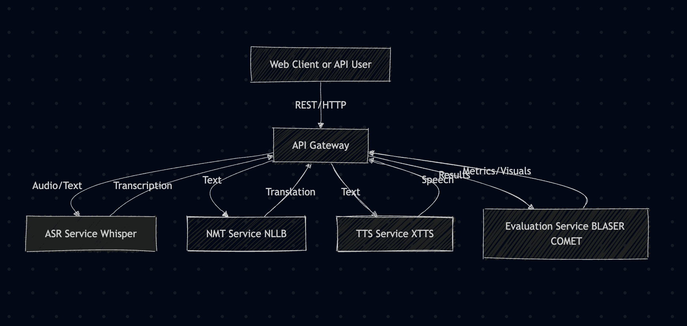

# Multimodal Translation Pipelines for Low-Resource African Languages

## Executive Summary

A research project exploring speech-to-speech translation for four low-resource African languages (Efik, Igbo, Swahili, Xhosa) through model fine-tuning and comprehensive evaluation.

**Core Technologies:** PyTorch • Hugging Face Transformers • Whisper (ASR) • NLLB-600M (NMT) • Coqui XTTS (TTS) • FastAPI • BLASER 2.0

**Key Achievements:**
- Fine-tuned 6 XTTS model variants + NLLB + 4 custom BLASER encoders
- Benchmarked 10+ pipeline combinations with comprehensive evaluation (BLEU, chrF, COMET, MCD, BLASER)
- Designed microservice architecture for experimentation
- 140+ hours of research and engineering on supercomputing infrastructure (SLURM, multi-GPU)

**Jump to:** [System Architecture](#system-overview) • [Technical Stack](#technical-stack) • [Results](#results)

## Project Summary
This repository documents a research and engineering effort focused on building, evaluating, and scaling speech-to-speech translation pipelines for four low-resource African languages: Efik, Igbo, Swahili, and Xhosa. The project blends hands-on deep learning, large-scale experimentation, and robust engineering:

- Fine-tuned multiple versions of Coqui XTTS for TTS on African languages
- Fine-tuned Meta NLLB-600M for neural machine translation (NMT)
- Developed and integrated custom BLASER 2.0 encoders for speech-to-speech evaluation
- Designed and benchmarked 10+ pipeline combinations (ASR, NMT, TTS)
- Built a modular microservice architecture for scalable, reproducible experiments
- Ran and debugged experiments on supercomputing clusters (SLURM, multi-GPU)
- Automated data processing, model training, and evaluation workflows
- Explored different data types, model architectures, and evaluation strategies

**Full technical report:** [Project Report](project_report/main.pdf)

## System Overview

The system uses a **microservices architecture** with HTTP/REST communication. Each service runs independently and can be scaled separately:

- **API Gateway** (Port 8075): Orchestrates the full translation pipeline (ASR → NMT → TTS), exposing a unified API for all services. Routes requests asynchronously using httpx.
- **ASR Service** (Port 8076): Speech-to-text using OpenAI Whisper (base/medium variants). Accepts 16kHz mono audio, outputs text transcriptions.
- **NMT Service** (Port 8077): Text-to-text translation using fine-tuned NLLB-600M with custom Efik tokenization. Supports English ↔ Efik/Igbo/Swahili/Xhosa.
- **TTS Service** (Port 8078): Text-to-speech using 6 fine-tuned Coqui XTTS variants (Native, Eng2Multi, Eng2Efik, Eng2Swa, BiTag, TransTag). Outputs 22050Hz audio with voice cloning support.
- **Evaluation Service** (Port 8079): Computes BLEU, chrF, COMET (text quality) and MCD, BLASER 2.0 (audio quality) metrics. Includes custom fine-tuned BLASER speech encoders for all four African languages.

## Technical Stack

### AI/ML Models

- **ASR**: OpenAI Whisper (whisper-base, whisper-medium)
- **NMT**: Meta NLLB-200-distilled-600M (fine-tuned with custom Efik tokens)
- **TTS**: Coqui XTTS v2.0.1 (6 fine-tuned variants trained on African languages)
- **Evaluation**: COMET (McGill-NLP/ssa-comet-qe), BLASER 2.0 with custom speech encoders

### Core Libraries

- **Deep Learning**: PyTorch 2.8.0, Hugging Face Transformers 4.56.2
- **Web Framework**: FastAPI + uvicorn (async microservices)
- **Audio Processing**: librosa 0.11.0, torchaudio 2.8.0, Coqui TTS
- **Evaluation Metrics**: sacrebleu, unbabel-comet, mel-cepstral-distance, sonar-space
- **Data**: pandas, numpy, datasets (Hugging Face)

### Languages Supported

- **Source**: English
- **Target**: Efik, Igbo, Swahili, Xhosa (low-resource African languages)

### Infrastructure

- **Deployment**: CPU inference (all services), lazy model loading
- **Communication**: HTTP/REST with JSON, base64 audio encoding
- **Training**: SLURM multi-GPU jobs on supercomputer

## Pipeline Variants & Model Details

| Model Name   | Input                | Output         |
|-------------|----------------------|----------------|
| Native      | African text         | African audio  |
| Eng2Multi   | English text         | African audio  |
| Eng2Efik    | English text         | Efik audio     |
| Eng2Swa     | English text         | Swahili audio  |
| BiTag       | <eng>{eng} <lang>{lang} | African audio  |
| TransTag    | <translate> <eng>{eng} <lang>{lang} | African audio  |

## Pipeline Combinations

| Pipeline   | Translation         | TTS Model      |
|------------|---------------------|----------------|
| Pipeline 1 | NLLB                | Native         |
| Pipeline 2 | NLLB                | BiTag          |
| Pipeline 3 | None                | BiTag          |
| Pipeline 4 | NLLB (custom format)| BiTag          |
| Pipeline 5 | NLLB                | TransTag       |
| Pipeline 6 | None                | TransTag       |
| Pipeline 7 | NLLB (custom format)| TransTag       |
| Pipeline 8 | None                | Eng2Multi      |
| Pipeline 9 | None                | Eng2Efik       |
| Pipeline 10| None                | Eng2Swa        |

## Evaluation Metrics
- **Text**: BLEU, chrF, COMET (McGill-NLP/ssa-comet-qe)
- **Audio**: MCD (Mel-Cepstral Distance), BLASER 2.0 (custom encoders for African languages)

## Results

**Evaluation Dataset:** 300 samples per language (1,200 total), provided by Pathsay program. Synthetic English audio generated using Whisper medium.

### NLLB Translation Quality
| Language | BLEU | chrF | COMET |
|----------|---------------------|---------------------|-------------------|
| Efik     | 29.8 ± 18.6         | 59.0 ± 14.2         | 0.603 ± 0.068     |
| Igbo     | 33.0 ± 23.5         | 60.6 ± 17.8         | 0.641 ± 0.068     |
| Swahili  | 49.2 ± 18.5         | 76.0 ± 10.5         | 0.676 ± 0.051     |
| Xhosa    | 32.4 ± 20.7         | 71.1 ± 12.8         | 0.649 ± 0.048     |
| **Overall** | **36.1 ± 7.7**   | **66.7 ± 7.1**      | **0.642 ± 0.026** |

### Audio & Speech Quality (MCD, BLASER)
| Metric | Pipeline | Efik | Igbo | Swahili | Xhosa | Overall |
|--------|----------|------|------|---------|-------|---------|
| **MCD** | NLLB → Native | **13.12 ± 1.35** | **12.96 ± 1.21** | **13.40 ± 0.95** | **11.89 ± 1.06** | **12.84 ± 0.57** |
| **BLASER** | Source → Eng2Multi | 2.72 ± 0.21 | 3.07 ± 0.25 | **2.84 ± 0.24** | **2.85 ± 0.24** | **2.87 ± 0.13** |

## Professional/Technical Highlights
- 140+ hours of hands-on engineering and research
- Experience with supercomputing (SLURM, multi-GPU jobs, debugging at scale)
- Deep learning: model finetuning, transfer learning, and custom evaluation
- Data engineering: cleaning, aligning, and managing multilingual/multimodal datasets
- Experimentation: rapid prototyping, ablation studies, and pipeline benchmarking
- Robust, production-style codebase with clear separation of concerns
