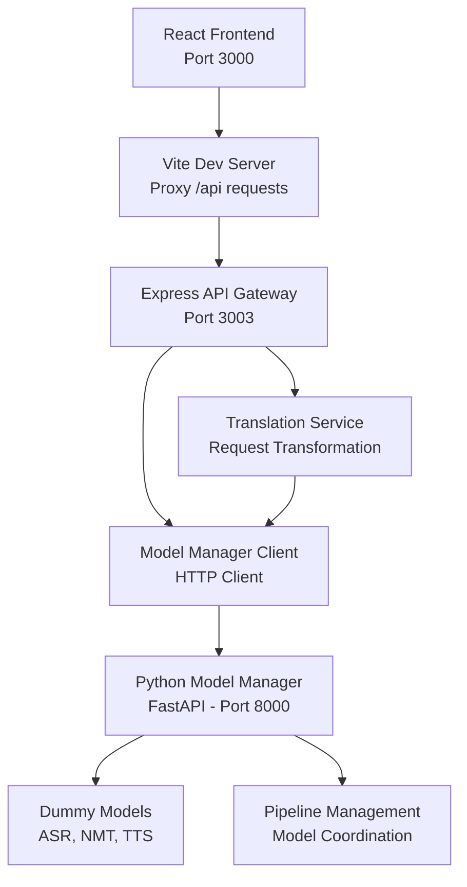

# Development Guide - Multimodal Translation Pipeline

## 📋 Table of Contents
1. [Architecture Deep Dive](#architecture-deep-dive)
2. [Development Setup](#development-setup)
3. [Code Structure](#code-structure)
4. [API Flow Explained](#api-flow-explained)
5. [Adding New Features](#adding-new-features)
6. [Testing Strategy](#testing-strategy)
7. [Deployment Guide](#deployment-guide)

## 🏗️ Architecture Deep Dive

### System Components



### Data Flow

1. **User Input** → React component state
2. **Frontend Request** → Axios call to `/api/translate`
3. **Vite Proxy** → Routes to API Gateway (port 3003)
4. **API Gateway** → Express server processes request
5. **Translation Service** → Transforms request for Model Manager
6. **Model Manager Client** → HTTP call to Python service
7. **FastAPI Processing** → Generates dummy responses
8. **Response Chain** → Back through all layers to frontend

## 🚀 Development Setup

### Prerequisites Installation
```bash
# Node.js (v18+)
curl -fsSL https://deb.nodesource.com/setup_18.x | sudo -E bash -
sudo apt-get install -y nodejs

# Python (3.9+)
sudo apt-get install python3.9 python3.9-venv python3.9-dev

# Git (if not installed)
sudo apt-get install git
```

### Environment Setup
```bash
# 1. Clone repository
git clone <repository-url>
cd multimodal-translation-pipeline

# 2. Setup Python environment
cd model-manager
python3 -m venv venv
source venv/bin/activate
pip install -r requirements-simple.txt
cd ..

# 3. Setup Node.js environment
cd frontend
npm install
cd ..

# 4. Verify setup
./start.sh  # Should start all services
```

### Development Environment Variables

Create `.env` files for different environments:

**Frontend `.env`**:
```bash
# frontend/.env
VITE_API_BASE_URL=http://localhost:3003
VITE_MODEL_MANAGER_URL=http://localhost:8000
VITE_DEBUG=true
```

**Model Manager `.env`**:
```bash
# model-manager/.env
DEBUG=true
HOST=0.0.0.0
PORT=8000
LOG_LEVEL=DEBUG
```

## 📂 Code Structure

### Frontend Structure
```
frontend/
├── src/
│   ├── client/                    # React application
│   │   ├── components/           # UI components
│   │   │   ├── TranslationInterface.tsx   # Main translation UI
│   │   │   ├── PipelineConfig.tsx         # Pipeline management
│   │   │   └── ResultDisplay.tsx          # Results visualization
│   │   ├── App.tsx               # Root component
│   │   └── main.tsx              # React entry point
│   ├── server/                   # Express API Gateway
│   │   ├── index.ts              # Main server file
│   │   ├── model-manager-client.ts   # HTTP client for Model Manager
│   │   └── translation-service.ts   # Request transformation layer
│   └── shared/                   # Shared types and utilities
│       └── types.ts              # TypeScript interfaces
├── package.json                  # Dependencies and scripts
└── vite.config.ts               # Vite configuration
```

### Model Manager Structure
```
model-manager/
├── main.py                       # FastAPI application
├── models.py                     # Pydantic models and dummy data
├── config.py                     # Configuration management
├── run.py                        # Development server launcher
├── test_api.py                   # Comprehensive test suite
├── requirements-simple.txt       # Python dependencies
└── Dockerfile                    # Container configuration
```

### Key Code Patterns

#### Frontend Component Pattern
```typescript
// TranslationInterface.tsx
interface Props {
  onTranslationComplete?: (result: TranslationResponse) => void;
}

const TranslationInterface: React.FC<Props> = ({ onTranslationComplete }) => {
  const [loading, setLoading] = useState(false);
  const [result, setResult] = useState<TranslationResponse | null>(null);
  
  const handleSubmit = async () => {
    setLoading(true);
    try {
      const response = await fetch('/api/translate', {
        method: 'POST',
        headers: { 'Content-Type': 'application/json' },
        body: JSON.stringify(requestData)
      });
      const data = await response.json();
      setResult(data.data);
      onTranslationComplete?.(data.data);
    } catch (error) {
      console.error('Translation failed:', error);
    } finally {
      setLoading(false);
    }
  };
};
```

#### API Gateway Pattern
```typescript
// index.ts
app.post('/api/translate', async (req, res) => {
  try {
    console.log('📥 Received translation request');
    
    const requestData = req.body.request ? JSON.parse(req.body.request) : req.body;
    requestData.pipelineId = requestData.pipelineId || 'baseline';
    
    const result = await translationService.processTranslation(requestData);
    
    const response: ApiResponse<any> = {
      data: { success: true, result, timestamp: new Date().toISOString() },
      message: 'Translation completed successfully'
    };
    
    res.json(response);
  } catch (error) {
    console.error('Translation processing failed:', error);
    res.status(500).json({
      data: { success: false, error: error.message },
      message: 'Translation failed'
    });
  }
});
```

#### Model Manager Pattern
```python
# main.py
@app.post("/translate/text", response_model=TranslationResponse)
async def translate_text(request: TranslationRequest):
    """Perform neural machine translation."""
    try:
        # Validate model availability
        if request.model not in loaded_models.get("nmt", []):
            raise HTTPException(
                status_code=400,
                detail=f"Model '{request.model}' not available"
            )
        
        # Generate dummy response
        response = DummyDataGenerator.generate_translation_response(
            text=request.text,
            source_lang=request.sourceLang,
            target_lang=request.targetLang
        )
        
        return response
        
    except Exception as e:
        logger.error(f"Translation failed: {str(e)}")
        raise HTTPException(status_code=500, detail=str(e))
```

## 🔄 API Flow Explained

### 1. Frontend Request Preparation
```typescript
// User clicks "Translate" button
const requestData = {
  type: 'text-to-text',
  sourceLang: 'en',
  targetLang: 'es', 
  input: 'Hello world',
  pipelineId: 'baseline'
};

// Sent via fetch to /api/translate
```

### 2. API Gateway Processing
```typescript
// Express middleware chain:
// 1. CORS handling
// 2. JSON body parsing  
// 3. Route matching (/api/translate)
// 4. Request validation
// 5. Translation service call
// 6. Response formatting
```

### 3. Translation Service Layer
```typescript
// translation-service.ts
async processTranslation(request: TranslationRequest) {
  // 1. Get pipeline configuration
  const pipeline = await this.getPipeline(request.pipelineId);
  
  // 2. Route to appropriate handler
  switch (request.type) {
    case 'text-to-text':
      return await this.handleTextToText(request, pipeline);
    case 'text-to-speech':
      return await this.handleTextToSpeech(request, pipeline);
    // ... other types
  }
}
```

### 4. Model Manager Communication
```typescript
// model-manager-client.ts
async translateText(request) {
  const response = await fetch(`${this.baseUrl}/translate/text`, {
    method: 'POST',
    headers: { 'Content-Type': 'application/json' },
    body: JSON.stringify(request)
  });
  
  return await response.json();
}
```

### 5. Python Model Processing
```python
# main.py FastAPI endpoint
@app.post("/translate/text")
async def translate_text(request: TranslationRequest):
    # 1. Validate request
    # 2. Load appropriate model (dummy)
    # 3. Process translation (dummy)
    # 4. Generate response with metadata
    return TranslationResponse(...)
```

## ➕ Adding New Features

### Adding a New Translation Type

1. **Update Types** (`frontend/src/shared/types.ts`):
```typescript
export type TranslationType = 
  | 'text-to-text' 
  | 'text-to-speech' 
  | 'speech-to-text' 
  | 'speech-to-speech'
  | 'document-translation'; // New type
```

2. **Frontend Component** (`TranslationInterface.tsx`):
```typescript
const translationTypes = [
  { value: 'text-to-text', label: 'Text → Text' },
  { value: 'text-to-speech', label: 'Text → Speech' },
  { value: 'speech-to-text', label: 'Speech → Text' },
  { value: 'speech-to-speech', label: 'Speech → Speech' },
  { value: 'document-translation', label: 'Document → Document' }, // New
];
```

3. **Translation Service** (`translation-service.ts`):
```typescript
async processTranslation(request: TranslationRequest) {
  switch (request.type) {
    case 'document-translation':
      return await this.handleDocumentTranslation(request, pipeline);
    // ... existing cases
  }
}

private async handleDocumentTranslation(request: TranslationRequest, pipeline: PipelineConfig) {
  // Implementation for document translation
  const result = await this.modelManagerClient.translateDocument({
    model: pipeline.models.nmt?.id || 'opus-mt',
    sourceLang: request.sourceLang,
    targetLang: request.targetLang,
    document: request.input,
    options: request.options
  });
  
  return {
    translatedDocument: result.translation.document,
    metadata: result.metadata
  };
}
```

4. **Model Manager** (`model-manager/main.py`):
```python
@app.post("/translate/document", response_model=DocumentTranslationResponse)
async def translate_document(
    model: str = Form(...),
    sourceLang: str = Form(...),
    targetLang: str = Form(...),
    document: UploadFile = File(...),
    options: Optional[str] = Form(default="{}")
):
    """Translate entire documents while preserving formatting."""
    # Implementation for document translation
    pass
```

### Adding a New Model

1. **Update Model List** (`model-manager/main.py`):
```python
loaded_models = {
    "asr": ["whisper-base", "whisper-large"],
    "nmt": ["opus-mt", "mbart-large", "new-model"],  # Add here
    "tts": ["espeak-ng", "tacotron2"]
}
```

2. **Add Model Configuration**:
```python
# In pipeline configuration
{
    "id": "new-pipeline",
    "name": "New Model Pipeline", 
    "models": {
        "nmt": {"id": "new-model", "name": "New Model", "version": "v1"}
    }
}
```

3. **Update Dummy Data Generator**:
```python
# models.py
def generate_translation_response(text: str, source_lang: str, target_lang: str, model: str = "opus-mt"):
    if model == "new-model":
        # Special handling for new model
        translation = f"[NEW-MODEL {source_lang}→{target_lang}]: {text}"
    else:
        translation = f"[DUMMY TRANSLATION {source_lang}→{target_lang}]: {text}"
```

## 🧪 Testing Strategy

### Unit Testing
```bash
# Frontend component tests
cd frontend
npm test

# Python unit tests  
cd model-manager
python -m pytest tests/
```

### Integration Testing
```bash
# API endpoint testing
cd model-manager
python test_api.py

# Full system test
curl -X POST http://localhost:3003/api/translate \
  -H "Content-Type: application/json" \
  -d '{"type": "text-to-text", "input": "test"}'
```

### Load Testing
```bash
# Using Apache Bench
ab -n 100 -c 10 http://localhost:3003/api/health

# Using curl in loop
for i in {1..10}; do
  curl -s http://localhost:3003/api/translate \
    -H "Content-Type: application/json" \
    -d '{"type": "text-to-text", "input": "test"}' &
done
wait
```

## 📦 Deployment Guide

### Docker Deployment

**Model Manager Dockerfile**:
```dockerfile
FROM python:3.9-slim

WORKDIR /app
COPY requirements-simple.txt .
RUN pip install -r requirements-simple.txt

COPY . .
EXPOSE 8000

CMD ["python", "run.py"]
```

**Docker Compose**:
```yaml
version: '3.8'
services:
  model-manager:
    build: ./model-manager
    ports:
      - "8000:8000"
    environment:
      - DEBUG=false
      - HOST=0.0.0.0
      
  api-gateway:
    build: ./frontend
    ports:
      - "3003:3003"
    depends_on:
      - model-manager
    environment:
      - MODEL_MANAGER_URL=http://model-manager:8000
      
  frontend:
    build: ./frontend
    ports:
      - "3000:3000"
    depends_on:
      - api-gateway
```

### Production Configuration

**Environment Variables**:
```bash
# Production .env
NODE_ENV=production
DEBUG=false
MODEL_MANAGER_URL=https://model-manager.example.com
API_GATEWAY_URL=https://api.example.com
```

**Nginx Configuration**:
```nginx
server {
    listen 80;
    server_name translation.example.com;
    
    location / {
        proxy_pass http://localhost:3000;
        proxy_set_header Host $host;
        proxy_set_header X-Real-IP $remote_addr;
    }
    
    location /api/ {
        proxy_pass http://localhost:3003;
        proxy_set_header Host $host;
        proxy_set_header X-Real-IP $remote_addr;
    }
}
```

## 🔧 Development Tools

### Useful VS Code Extensions
- TypeScript Hero
- Python Extension Pack  
- REST Client
- GitLens
- Prettier
- ESLint

### Debug Configuration

**VS Code `launch.json`**:
```json
{
  "version": "0.2.0",
  "configurations": [
    {
      "name": "Debug API Gateway",
      "type": "node",
      "request": "launch",
      "program": "${workspaceFolder}/frontend/src/server/index.ts",
      "outFiles": ["${workspaceFolder}/frontend/dist/**/*.js"],
      "env": {
        "NODE_ENV": "development"
      }
    },
    {
      "name": "Debug Model Manager",
      "type": "python",
      "request": "launch",
      "program": "${workspaceFolder}/model-manager/run.py",
      "console": "integratedTerminal",
      "cwd": "${workspaceFolder}/model-manager"
    }
  ]
}
```

### Git Hooks

**Pre-commit Hook** (`.git/hooks/pre-commit`):
```bash
#!/bin/bash
# Run TypeScript checks
cd frontend && npx tsc --noEmit

# Run Python tests
cd ../model-manager && python -m pytest

# Run linting
cd ../frontend && npm run lint
```

This development guide should give you a comprehensive understanding of how to work with, modify, and extend the multimodal translation pipeline system!